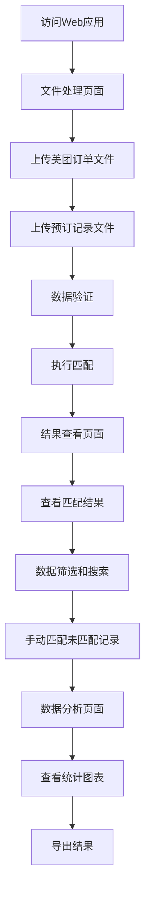

# 鹭府预定匹配工具 - 产品需求文档

## 1. 产品概述

鹭府预定匹配工具是一个专为鹭府餐厅设计的数据匹配分析系统，用于自动匹配餐厅预订记录与美团订单数据，提高运营效率和数据准确性。

该系统通过智能算法自动识别和匹配预订信息与实际订单，帮助餐厅管理人员快速核对预订完成情况，分析客户行为模式，优化餐厅运营管理。

目标市场价值：提升餐厅数字化管理水平，减少人工核对工作量，为餐厅运营决策提供数据支持。

## 2. 核心功能

### 2.1 用户角色

| 角色 | 使用方式 | 核心权限 |
|------|----------|----------|
| 餐厅管理员 | 直接访问Web应用 | 可上传文件、执行匹配、查看所有数据、导出报告 |
| 数据分析员 | 直接访问Web应用 | 可查看匹配结果、进行数据分析、导出报告 |

### 2.2 功能模块

我们的鹭府预定匹配工具包含以下主要页面：

1. **文件处理页面**：文件上传模块、数据验证模块、匹配执行模块
2. **结果查看页面**：匹配结果展示、数据筛选、记录详情查看、手动匹配
3. **数据分析页面**：统计图表、客户分析、趋势分析、导出功能

### 2.3 页面详情

| 页面名称 | 模块名称 | 功能描述 |
|----------|----------|----------|
| 文件处理页面 | 文件上传模块 | 支持上传美团订单Excel文件和预订记录Excel文件，自动识别文件格式和列结构 |
| 文件处理页面 | 数据验证模块 | 验证上传文件的完整性和格式正确性，显示文件预览和基本统计信息 |
| 文件处理页面 | 匹配执行模块 | 执行智能匹配算法，支持完全匹配、数字匹配、外卖匹配等多种匹配策略 |
| 结果查看页面 | 匹配结果展示 | 以表格形式展示匹配结果，支持按匹配状态筛选（全部/已匹配/未匹配） |
| 结果查看页面 | 数据筛选模块 | 支持按预订人姓名搜索，智能处理同义词和别名匹配 |
| 结果查看页面 | 记录详情查看 | 点击记录查看详细信息，包括预订信息和对应的美团订单详情 |
| 结果查看页面 | 手动匹配模块 | 对未匹配记录提供手动匹配功能，可选择对应的美团订单进行关联 |
| 数据分析页面 | 统计图表模块 | 显示匹配统计信息，包括匹配率、匹配类型分布等关键指标 |
| 数据分析页面 | 客户分析模块 | 分析最活跃预订人，显示客户预订频次和偏好 |
| 数据分析页面 | 导出功能模块 | 支持导出匹配结果为Excel文件，包含完整的匹配数据和分析报告 |

## 3. 核心流程

**主要用户操作流程：**

1. 用户访问Web应用首页
2. 在文件处理页面上传美团订单Excel文件和预订记录Excel文件
3. 系统自动验证文件格式和数据完整性
4. 点击开始匹配按钮，系统执行智能匹配算法
5. 切换到结果查看页面，浏览匹配结果和统计信息
6. 使用筛选和搜索功能查找特定记录
7. 对未匹配记录进行手动匹配（可选）
8. 在数据分析页面查看详细分析图表
9. 导出匹配结果和分析报告

## 4. 用户界面设计

### 4.1 设计风格

- **主色调**：蓝色系（#3b82f6）作为主色，灰色系（#64748b, #0f172a）作为辅助色
- **按钮风格**：圆角按钮设计，支持悬停效果和状态变化
- **字体**：Microsoft YaHei, SimHei 中文字体，14px-16px 主要字号
- **布局风格**：卡片式布局，顶部标签页导航，响应式设计
- **图标风格**：使用emoji图标增强视觉效果，如📊📁📈等

### 4.2 页面设计概览

| 页面名称 | 模块名称 | UI元素 |
|----------|----------|--------|
| 文件处理页面 | 文件上传模块 | 虚线边框的拖拽上传区域，支持hover效果，使用#cbd5e1边框色和#f8fafc背景色 |
| 文件处理页面 | 匹配执行模块 | 蓝色主按钮（#3b82f6），全宽度设计，带loading状态和成功提示 |
| 结果查看页面 | 数据表格 | 带边框的数据表格，支持行选择，使用#e2e8f0边框色，8px圆角 |
| 结果查看页面 | 筛选控件 | 下拉选择框和搜索输入框，简洁的表单设计 |
| 数据分析页面 | 图表展示 | Plotly交互式图表，支持缩放和悬停，使用品牌色彩方案 |
| 全局样式 | 提示信息 | 彩色左边框的Alert组件，成功绿色#059669，错误红色#dc2626，警告橙色#d97706 |

### 4.3 响应式设计

该产品采用桌面优先的响应式设计，支持平板和移动设备访问。表格和图表组件支持水平滚动，确保在小屏幕设备上的可用性。界面布局采用Streamlit的列布局系统，自动适配不同屏幕尺寸。