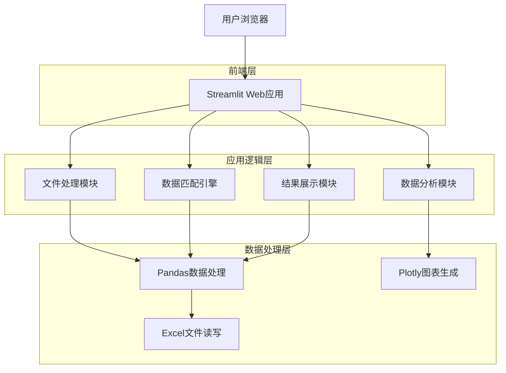
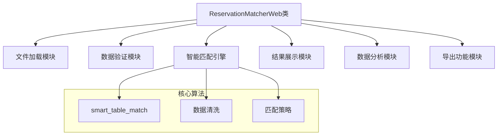
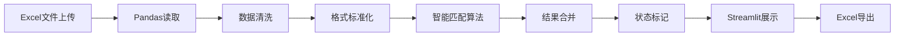
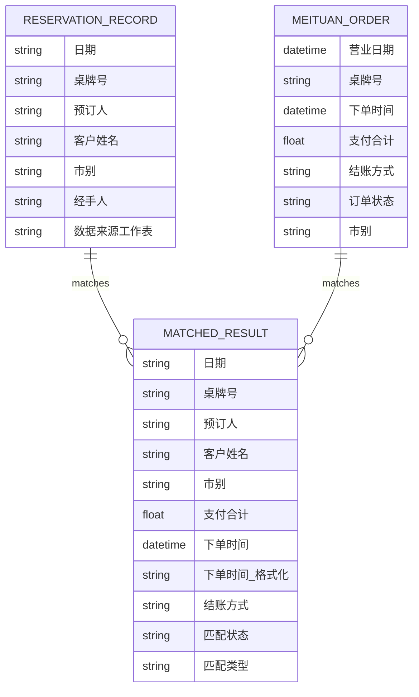

# 鹭府预定匹配工具 - 技术架构文档

## 1. 架构设计



## 2. 技术描述

* **前端**: Streamlit\@1.28.0 + 自定义CSS样式

* **数据处理**: Pandas\@1.5.0 + Python标准库

* **图表可视化**: Plotly\@5.0.0

* **系统监控**: psutil\@5.9.0

* **网络请求**: requests\@2.28.0

* **运行环境**: Python 3.8+

## 3. 路由定义

| 路由    | 用途                  |
| ----- | ------------------- |
| /     | 主页面，包含三个标签页的完整应用界面  |
| /文件处理 | 文件上传和数据匹配功能（标签页1）   |
| /结果查看 | 匹配结果展示和手动匹配功能（标签页2） |
| /数据分析 | 统计图表和数据分析功能（标签页3）   |

## 4. 核心组件架构

### 4.1 应用架构



### 4.2 数据流架构



## 5. 数据模型

### 5.1 数据模型定义



### 5.2 数据处理流程

**美团订单数据处理：**

```python
# 数据清洗
df = df[df['订单状态'] == '已结账']
df = df[df['营业日期'] != '--']

# 支付金额提取
def extract_payment(payment_str):
    numbers = re.findall(r'-?\d+\.?\d*', str(payment_str))
    return float(numbers[0]) if numbers else None

# 市别判断（基于下单时间）
def determine_market_period(order_time):
    hour = pd.to_datetime(order_time).hour
    if 6 <= hour < 16:
        return '午市'
    elif 16 <= hour <= 23:
        return '晚市'
    return None
```

**预订记录数据处理：**

```python
# 姓名标准化
def standardize_name(name):
    name_str = str(name).strip()
    # 处理同义词映射
    synonyms = {
        '平和': ['平和', '平哥'],
        '刘霞': ['刘霞', '刘'],
        '周思玗': ['周', '周思玗'],
        'SK': ['sk', 'SK']
    }
    for standard, variants in synonyms.items():
        if name_str in variants:
            return standard
    return name_str
```

**智能匹配算法：**

```python
def smart_table_match(reservation_table, meituan_table):
    # 1. 完全匹配（最高优先级）
    if str(reservation_table) == str(meituan_table):
        return True, "完全匹配"
    
    # 2. 数字部分匹配
    res_numbers = extract_numbers(reservation_table)
    mt_numbers = extract_numbers(meituan_table)
    
    if res_numbers and mt_numbers and res_numbers == mt_numbers:
        if is_takeout(meituan_table):
            return True, "外卖匹配"
        else:
            return True, "数字匹配"
    
    return False, "无匹配"
```

## 6. 部署方案

### 6.1 本地部署

```bash
# 安装依赖
pip install -r requirements.txt

# 启动应用
streamlit run streamlit_app.py --server.port 8501
```

### 6.2 生产环境部署

```bash
# 使用Docker部署
FROM python:3.9-slim
WORKDIR /app
COPY requirements.txt .
RUN pip install -r requirements.txt
COPY . .
EXPOSE 8501
CMD ["streamlit", "run", "streamlit_app.py", "--server.address", "0.0.0.0"]
```

### 6.3 云平台部署选项

* **Streamlit Cloud**: 直接连接GitHub仓库自动部署

* **Heroku**: 使用Procfile配置文件部署

* **AWS/阿里云**: 使用容器服务部署

* **本地服务器**: 使用nginx反向代理配置

## 7. 性能优化

* **文件处理优化**: 使用pandas的chunk读取处理大文件

* **内存管理**: 及时清理临时数据，使用session\_state管理状态

* **缓存策略**: 利用Streamlit的@st.cache装饰器缓存计算结果

* **UI响应**: 使用spinner显示加载状态，提升用户体验

